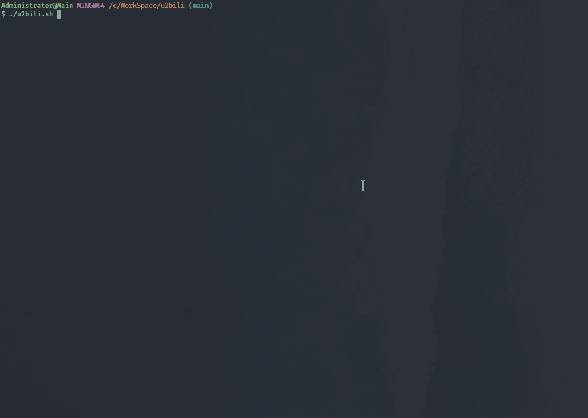
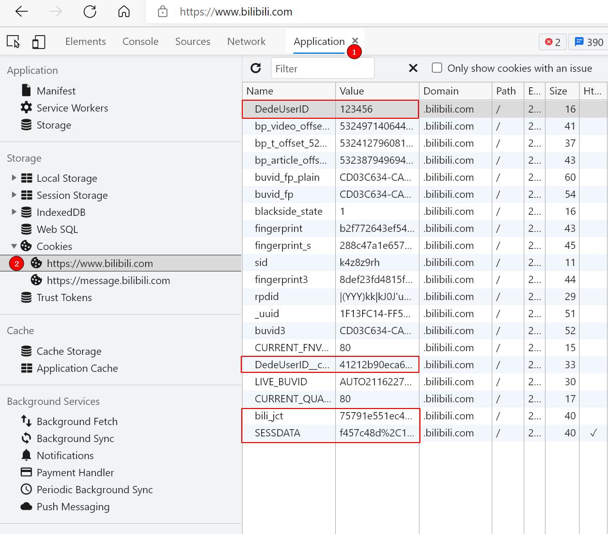

# youtube->bilibili 搬运脚本


<details>
    <summary>Demo preview</summary>


</details>

## 🍔食用方式 Install & Usage
1. 安装Python
2. 安装Node
3. 安装脚本库(有Gitbash的运行init.sh) 或 `npm install playwright && pip install youtube-dl`
4. 设置bilibili cookies（编辑config.js或设置`BILIBILI_COOKIE`环境变量）
5. u2bili.sh \<url\>

<details>
    <summary>关于获取Cookie</summary>
    
登录后F12,Application(应用程序)面板，选择cookie进行查看。

填写config.js最后4个参数或设置`BILIBILI_COOKIE`环境变量
```
BILIBILI_COOKIE环境变量格式如下：
DedeUserID=XXX; DedeUserID__ckMd5=XXX; bili_jct=XXX; SESSDATA=XXX
```
</details>

## 🍱食材 Frameworks
- youtube-dl 下载油管用
- playwright 上传B站用
## 🧂调味指南 Tinker & Deployment
<details>
    <summary>关于下载的清晰度</summary>

youtube-dl会检测PATH中有没有ffmpeg，找不到只能下载720P，不然会尝试下载更高的画质。<sup><a href="https://youtube-dl.readthedocs.io/en/latest/#basic-usage">文档</a></sup>
</details>

<details>
    <summary>在服务器端跑</summary>

默认是Windows上显示浏览器，其他系统不显示（Headless）。

需要设置环境变量`BILIBILI_COOKIE`

使用例：
```
./u2bili.sh https://www.youtube.com/watch?v=aAmP-WcI6dg
```
</details>

## ⚠免责声明
项目仅用于学习参考，如存在违反B站用户协议请使用者风险自负。

## 📜Licence
MIT

