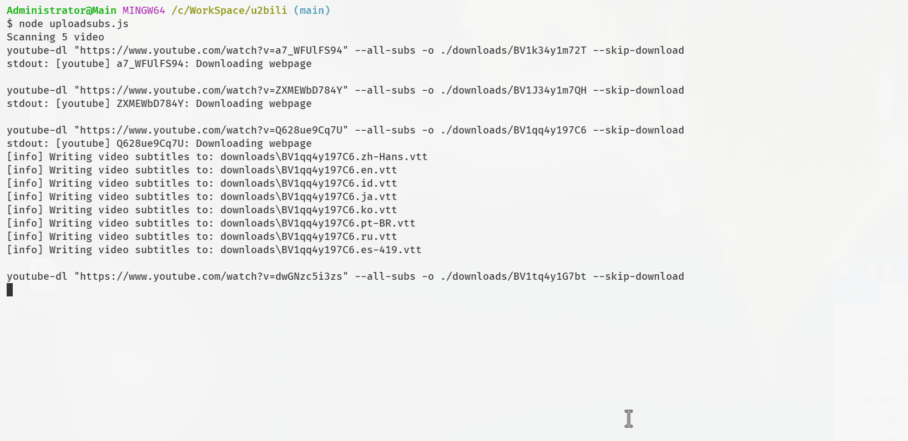

# youtube->bilibili 搬运脚本


<details>
    <summary>Demo预览</summary>


</details>

## 🍔使用
> node+python环境
1. 安装node依赖`yarn`或者`npm install`
2. 安装yt-dlp [文档](https://github.com/yt-dlp/yt-dlp#installation)
3. 提供cookies：编辑config.js或设置`BILIBILI_COOKIE`环境变量
4. bash u2bili.sh \<url\>

<details>
    <summary>关于获取Cookie</summary>
    
登录后F12,Application(应用程序)面板，选择cookie进行查看。

填写[config.js](config.js)最后4个参数或设置`BILIBILI_COOKIE`环境变量
```
BILIBILI_COOKIE环境变量格式如下：
DedeUserID=XXX; DedeUserID__ckMd5=XXX; bili_jct=XXX; SESSDATA=XXX
```
</details>

<details>
    <summary>✨字幕上传脚本预览</summary>
    

</details>

## 🍱使用框架 Frameworks
- yt-dlp
- playwright 
## 🧂Q&A
<details>
    <summary>📺关于下载的清晰度</summary>

yt-dlp文档 [github.com/yt-dlp/yt-dlp#format-selection](https://github.com/yt-dlp/yt-dlp#format-selection)
</details>

<details>
    <summary>🍥使用Github Action</summary>

<h2 ><b>❗重要提示：请clone后push到自己的私有仓库，使用<a href="https://github.com/settings/billing">额度内action时间！<a></b></h2>
<br>

Actions面板设置Secret `BILIBILI_COOKIE` （必要步骤）
```
DedeUserID=XXX; DedeUserID__ckMd5=XXX; bili_jct=XXX; SESSDATA=XXX
```
几个重要参数
- 扫描周期`schedule.cron` [.github/workflows/actionsflow.yml](.github/workflows/actionsflow.yml)
- 订阅频道`channel_id` [workflows/youtube.yml](workflows/youtube.yml)
- 视频条目过滤`filterScript` 默认只对比了时间选取24小时内的视频 [workflows/youtube.yml](workflows/youtube.yml)
  - [脚本文档](https://actionsflow.github.io/docs/workflow/#ontriggerconfigfilterscript)
  - [完整视频参数](https://actionsflow.github.io/docs/triggers/youtube/#outputs)
</details>

## ⚠免责声明
项目仅用于学习参考，如存在违反B站用户协议请使用者风险自负。

## 📜Licence
MIT

